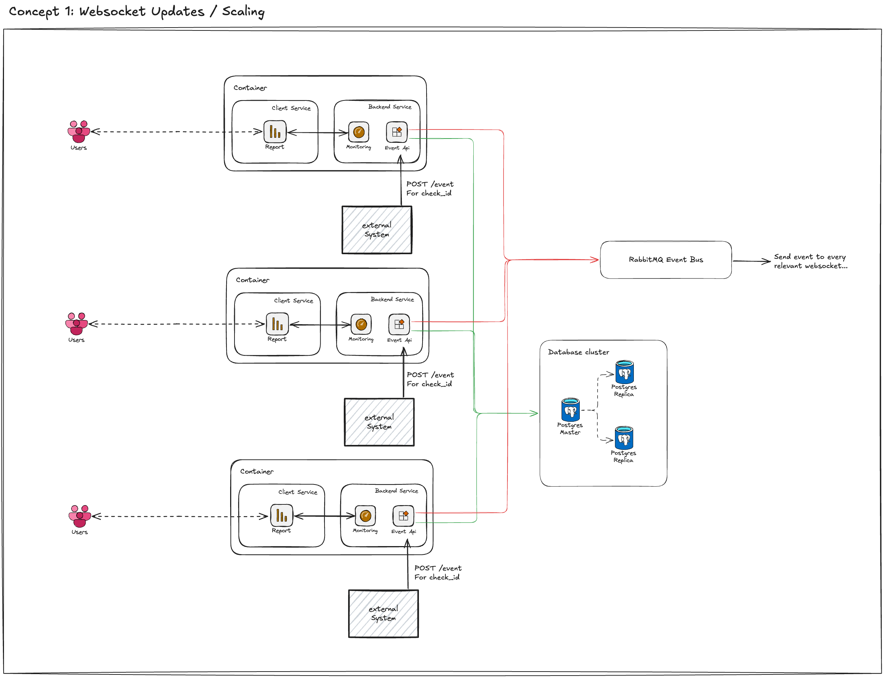
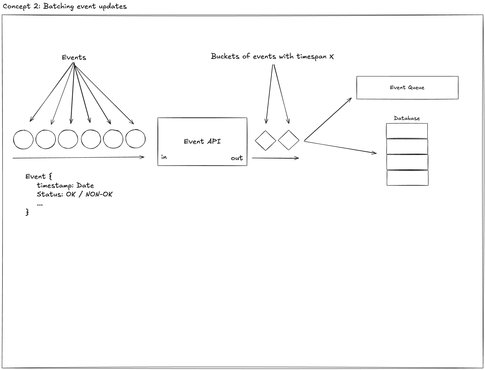

<p align="center">
    <h1 align="center">Eventify</h1>
</p>
<p align="center">Eventify.io - An intuitive tool to manage and monitor your services via intelligent event creation.</p>
<p align="center">
     
    
    
    
    
</p>

---

**Author:** Jordi
Jaspers [[Github](https://github.com/Jordi-Jaspers "Github Page"), [Linkedin](https://www.linkedin.com/in/jordi-jaspers/ "Linkedin Page")]
<p align="left">
<a href="https://ie.linkedin.com/in/jordi-jaspers">
 
</a>
<a href="https://ie.linkedin.com/in/jordi-jaspers">
 
</a>
<a href="https://github.com/Jordi-Jaspers?tab=followers">
 
</a>
<a href="https://github.com/Jordi-Jaspers?tab=repositories&sort=stargazers">
 
</a>
<a href="https://buymeacoffee.com/jaspers">
    
</a>
</p>

---

## Introduction 📝

A high-performance, scalable monitoring solution designed to track and visualize the health and status of distributed
systems in real-time. This application provides a robust platform for collecting, processing, and displaying monitoring
events from multiple external systems through a user-friendly dashboard interface.

**Website Preview:** https://eventify.io/  
**Website Health endpoint:** https://eventify.io/actuator/health  
**Server API description:** https://eventify.io/api/public/docs/openapi.html

### Overview

The Monitoring Service is built to handle high-throughput event processing with real-time updates, making it ideal for
organizations needing to monitor critical infrastructure and services. It features:

- **Real-time Monitoring**: Instant visibility into system health through WebSocket-powered live updates
- **Scalable Architecture**: Horizontally scalable design using event-driven microservices
- **Efficient Event Processing**: Smart batching and processing of events to handle high-volume monitoring data
- **Team-based Access Control**: Organized access management with team-based dashboard sharing
- **Customizable Dashboards**: Flexible dashboard configuration with support for grouped and ungrouped checks
- **High Availability**: Built on a reliable PostgreSQL cluster with replication for data durability
- **External System Integration**: Simple REST API for external systems to report their status

Whether you're monitoring a handful of services or thousands of endpoints, this platform is designed to provide
reliable, real-time insights into your systems' operational status.

### Concept 1: Websocket / Scaling



### Concept 2: Event Processing



### Excalidraw Diagram

https://excalidraw.com/#json=spCc5QGt8tOYZ-c9SCpLn,dXvLww8Lo9tZxBbOlpO_NA

### Database Schema 📊

https://dbdiagram.io/d/Eventify-673f8ef8e9daa85aca4c0697

## Getting Started 🚀

### Prerequisites

Before you begin, ensure you have the following installed:

- **Docker**
- **Docker Compose**
- **SDKMAN** or **ASDF**

### Project Setup

1. **Clone the repository**
   ```bash
   git clone <repo-url>
   ```

2. **Start the services**  
   Run the Docker Compose file to set up required services. This will start:
    * Inbucket (Email service)
    * TimescaleDB HA (High Availability version for Timescale extensions)

    ```bash
    docker-compose up -d
    ```

3. **Setup the database**  
   Use the provided Liquibase script to set up the database with test data:
   ```bash
   bash ./scripts/create-schema-postgres-local.sh -h localhost -p 5432 -P root
    ```

4. **Start the frontend**  
   Navigate to the client directory and install dependencies:
    ```bash
    cd client
    bun install
    bun run dev
    ```

5. **Start the backend**  
   Navigate to the server directory and run the application:
    ```bash
    cd server
    ./gradlew bootRun
    ```
6. **Access the app**  
   Open your browser and go to the following URL:
    - http://localhost:5173/login

   Use the default credentials to log in:
    - **Username:** johndoe@gmail.com
    - **Password:** Testing1!


7. **API Documentation**  
   You can view the API documentation at:
    - http://localhost:8080/api/public/docs/openapi.html


8. **Adjust Environment Variables**  
   You can adjust the environment variables in the `./gradlew bootRun` command to customize the application
   configuration.

| Environment Variable          | Default Value                                   | Purpose                                                 |
|-------------------------------|-------------------------------------------------|---------------------------------------------------------|
| **APPLICATION CONFIGURATION** |                                                 |                                                         |
| `SPRING_APPLICATION_URL`      | `http://localhost:5173`                         | Base URL of the application.                            |
| **EMAIL CONFIGURATION**       |                                                 |                                                         |
| `EMAIL_HOST`                  | `localhost`                                     | Email server host.                                      |
| `EMAIL_PORT`                  | `2500`                                          | Email server port.                                      |
| `EMAIL_ADDRESS`               | `no-reply@localhost`                            | Sender email address.                                   |
| `EMAIL_USERNAME`              | `no-login@localhost.com`                        | Username for email authentication.                      |
| `EMAIL_PASSWORD`              | `password`                                      | Password for email authentication.                      |
| **SECURITY CONFIGURATION**    |                                                 |                                                         |
| `JWT_LIFETIME_SECONDS`        | `900`                                           | Lifetime of JWT tokens in seconds.                      |
| `CORS_ALLOWED_ORIGINS`        | `*`                                             | Comma-separated list of allowed origins for CORS.       |
| **SPRING CONFIGURATION**      |                                                 |                                                         |
| `SPRING_PROFILES_INCLUDE`     | `development`                                   | Active Spring profiles.                                 |
| `DATASOURCE_TOP_URL`          | `jdbc:postgresql://localhost:5432/tst_eventify` | JDBC URL for the database.                              |
| `DATASOURCE_TOP_USERNAME`     | `tst_eventify`                                  | Database username.                                      |
| `DATASOURCE_TOP_PASSWORD`     | `tst_eventify`                                  | Database password.                                      |
| **LOGGING CONFIGURATION**     |                                                 |                                                         |
| `SQL_LOG_LEVEL`               | `INFO`                                          | `DEBUG` for database logging and `INFO` to turn it off. |

## Dang, you found a bug, now what? 🐞

No worries, just check out our [**issues**](https://github.com/Jordi-Jaspers/Eventify) section on GitHub. If you can't
find your issue, feel free to create a new one. We trample that bug as soon as possible.

## Support & Contributions ☕️

#### Current Contributors

- [Giuseppe Collura](https://github.com/GiuseppeCollura "Github Page")

#### Want to contribute to the project?

All the extra help is welcome! Just fork the project and create a pull request. If you have any questions, feel free to
contact me via email <jordijaspers@gmail.com> or discord for any additional information.

#### Any more ideas for features?

Feel free to create an issue and we can discuss it further.

#### Want to support the project?

You can support and keep alive your anime sanctum by donating here:

<p>
<a href="https://buymeacoffee.com/jaspers">
    
</p>

## Stack 🛠️

- [Spring Boot](https://spring.io/projects/spring-boot) - Java framework for building back-end applications.
- [Redis](https://redis.io/) - In-memory data structure store.
- [SvelteKit](https://kit.svelte.dev/) - Frontend framework for building web applications.
- [TailwindCSS](https://tailwindcss.com/) - Utility-first CSS framework.
- [Shadcn Svelte](https://www.shadcn-svelte.com/) - Svelte components library.
- [Lucide](https://lucide.dev/) - SVG icons library.
- [Cloudflare](https://www.cloudflare.com/) - CDN and DNS provider.
- [Traefik](https://traefik.io/) - Reverse proxy and load balancer.
- [Docker](https://www.docker.com/) - Containerization platform.
- [Liquibase](https://www.liquibase.org/) - Database migration tool
- [TimescaleDB](https://www.timescale.com/) - Time-series database
- [Git](https://git-scm.com/) - Version Control

## License 📜

Licensed under [GPL-3.0](https://www.gnu.org/licenses/gpl-3.0.html#license-text).
